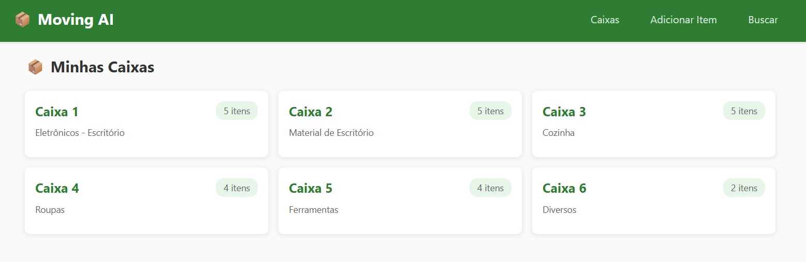
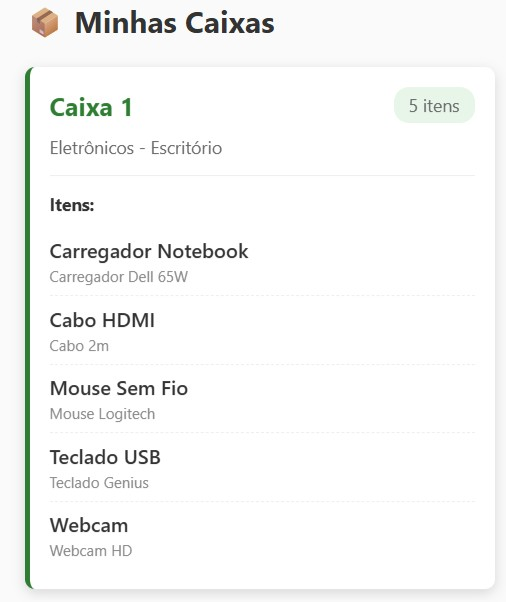
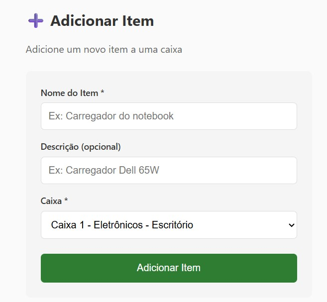
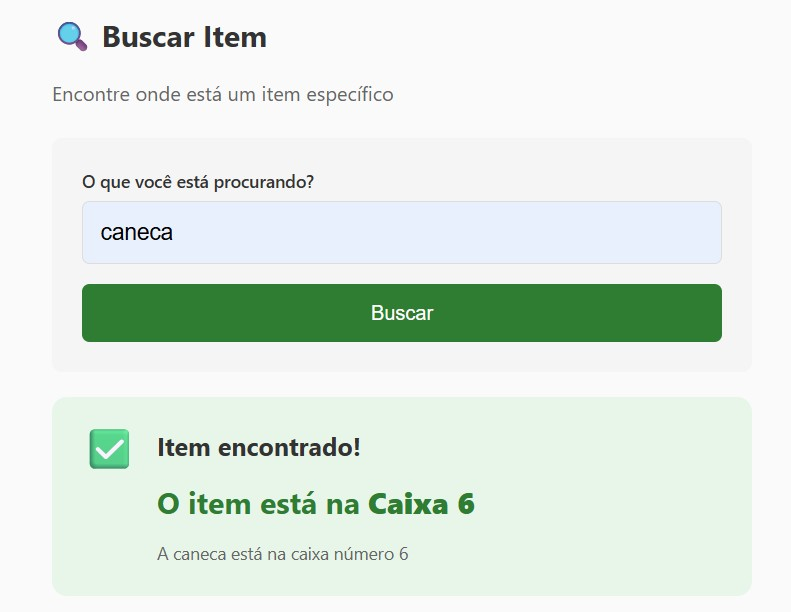

## 🚀 May The Fourth 2026 - Moving AI

Desafio 2 do **May The Fourth 2026** realizado pelo [balta.io](https://balta.io).

# Meu repositório Central

https://github.com/b01tech/balta-desafio-may-the-fourth-2026.git

---

### Sobre o desafio

Sistema de inventário inteligente onde você cadastra itens em caixas numeradas e pergunta à IA onde está um item específico.

#### Nível 3 - Fullstack + IA

- Estruturar projeto de IA completo
- Expor endpoints para gerenciamento de caixas e itens
- Integrar IA para busca inteligente de itens

## 🛠️ Stack

- **Backend:** .NET 10, Minimal API, Entity Framework Core, SQLite
- **Frontend:** Angular 21, Standalone Components, Signals
- **IA:** OpenRouter API (modelos gratuitos)

## 📁 Estrutura do Projeto

```
backend/
├── src/
│   ├── Api/              # API minimal com endpoints
│   ├── Application/      # Serviços de negócio
│   ├── Core/             # Entidades, DTOs, Interfaces
│   ├── Infrastructure/   # Repositórios, DbContext
│   └── AI/               # Agente Moving, configurações
└── test/
    ├── Core.Test/        # Testes Core
    └── Application.Test/ # Testes Application

frontend/
└── src/app/
    ├── services/         # MovingService (API calls)
    └── components/       # CaixaList, ItemAdd, ItemSearch
```

## 🚀 Como executar

### Backend

```bash
cd backend/src/Api
dotnet restore
dotnet build
dotnet run
```

**Configuração:**
Adicionar chave da API no arquivo `appsettings.json`:

```json
{
  "AI": {
    "ApiKey": "sua-chave-openrouter",
    "Model": "deepseek/deepseek-chat-v3-0324"
  }
}
```

API disponível em: `http://localhost:5000`

### Frontend

```bash
cd frontend
npm install
npm start
```

Frontend disponível em: `http://localhost:4200`

## 📋 Endpoints

| Método | Endpoint           | Descrição                 |
| ------ | ------------------ | ------------------------- |
| GET    | `/api/caixas`      | Lista todas as caixas     |
| GET    | `/api/caixas/{id}` | Busca caixa por ID        |
| POST   | `/api/caixas`      | Cria nova caixa           |
| POST   | `/api/itens`       | Adiciona item a uma caixa |
| POST   | `/api/buscar`      | Busca item (com IA)       |

### Payload - POST /api/caixas

```json
{
  "numero": 6,
  "descricao": "Caixa de ferramentas"
}
```

### Payload - POST /api/itens

```json
{
  "nome": "Chave Philips",
  "descricao": "Chave de Phillips pequena",
  "caixaId": 5
}
```

### Payload - POST /api/buscar

```json
{
  "termoBusca": "carregador"
}
```

## ✅ Funcionalidades

- [x] Listar todas as caixas com seus itens
- [x] Adicionar novos itens às caixas
- [x] Busca de itens com IA (OpenRouter)
- [x] Interface com Angular
- [x] 24 testes unitários passando

## 🧪 Testes

```bash
dotnet test backend/test/Core.Test/Core.Test.csproj
dotnet test backend/test/Application.Test/Application.Test.csproj
```

## 📸 Screenshots

### Lista de Caixas



### Lista de Itens



### Adicionar Item



### Buscar Item



## 📝 Licença

MIT License
